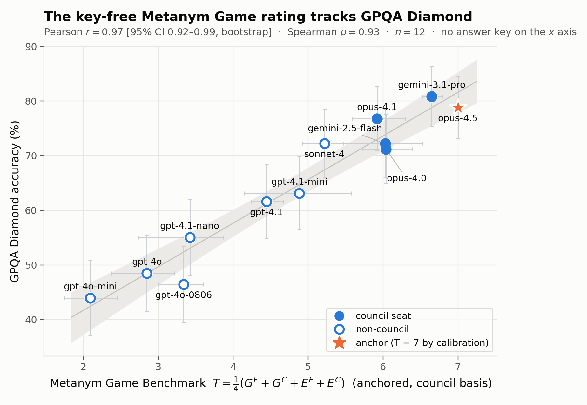

# The Metanym Game

**An LLM benchmark without ground truth that rises with the models it measures.**

David Nordfors (david.nordfors@archetypes.ai) ·
Paper: [arXiv:2606.21008](https://arxiv.org/abs/2606.21008) ·
DOI: [10.48550/arXiv.2606.21008](https://doi.org/10.48550/arXiv.2606.21008)

## Abstract

We present evidence that analogy is at the core of LLM intelligence. In our benchmark, LLMs
compete in generating sets of analogous statements and rate each other's sets on their own
understandings of factual correctness, beauty, intelligence, distinctness, length, and structural
diversity. Nothing enters from outside: the only given is the game rules; every item is generated
in play; the scores come from the players' ratings alone. Ground truth is replaced by the SVD of
the factual rating matrix, which scores players as generators and judges at once — to our
knowledge the first eigen-equation that judges the judges for an LLM council-of-peers. For
subjective criteria like beauty, judges are weighted by their rating consistency. The best
generators turn out to be middling judges. GPQA Diamond — difficult multiple-choice questions
written by human experts — could not be more different in method, yet the two benchmarks correlate
at Pearson *r* = 0.97, 95% CI [0.92, 0.99]; no leakage could be found. A council of the five best
issues the official ratings; its contestable seats let the benchmark scale to any number of
players and rise with the models it measures — a candidate steering signal for self-improving AI.
Playing interweaves at least eight constructs of intelligence; the total scores the broad
composite, the components allow reductionistic analysis. Every number recomputes from a released
package on GitHub.

## What the game is

*Excerpt from the paper, §2.a — one archetype from an actual submission in the canonical run
(claude-opus-4.5's, the portfolio later pinned as the anchor).* The template:

> "A [NAVIGATOR] moves through a [SPACE] by sensing local [GRADIENT] and adjusting its
> [TRAJECTORY] accordingly. The [NAVIGATOR] cannot perceive the entire [SPACE] at once; it relies
> on [SENSOR] that detect changes in [SIGNAL] concentration or intensity. When [GRADIENT] are steep
> and consistent, the [NAVIGATOR] converges efficiently toward [ATTRACTOR]. When [GRADIENT] are
> shallow, noisy, or conflicting, the [NAVIGATOR] may stall, oscillate, or become trapped in local
> [ATTRACTOR]. [INTERFERENCE] can distort the [GRADIENT], causing the [NAVIGATOR] to veer off
> course. Successful navigation requires not only sensitive [SENSOR] but also [MEMORY] of recent
> [TRAJECTORY] to distinguish genuine [GRADIENT] from transient [NOISE]. Some [NAVIGATOR] emit
> their own [SIGNAL] to recruit other [NAVIGATOR] toward the same [ATTRACTOR], creating collective
> [TRAJECTORY] that amplify the original [GRADIENT]."

and its metanym table:

| [SLOT]       | Bacterial Chemotaxis | Mountain Climbing | Career Development   | Gradient Descent | Ant Foraging        |
|--------------|----------------------|-------------------|----------------------|------------------|---------------------|
| NAVIGATOR    | bacterium            | climber           | professional         | optimizer        | ant                 |
| SPACE        | chemical environment | mountain          | job market           | loss landscape   | terrain             |
| GRADIENT     | chemical gradient    | slope             | opportunity gradient | gradient         | pheromone trail     |
| TRAJECTORY   | swimming path        | route             | career path          | parameter update | foraging path       |
| SENSOR       | chemoreceptor        | proprioception    | network contact      | backpropagation  | antenna             |
| SIGNAL       | chemoattractant      | elevation         | opportunity signal   | loss value       | pheromone           |
| ATTRACTOR    | nutrient source      | summit            | desirable position   | minimum          | food source         |
| INTERFERENCE | toxin                | fog               | misinformation       | noisy data       | rain                |
| MEMORY       | methylation state    | route memory      | experience           | momentum         | path integration    |
| NOISE        | Brownian motion      | wind              | market volatility    | stochastic noise | environmental noise |

*One context template (rows are slots) filled by five metanym sets (columns are domains). MEMORY is
realised as a bacterium's methylation state, a climber's route memory, a professional's experience,
an optimiser's momentum term and an ant's path integration — five mechanisms that share a
structural role without being synonyms.*

Each parallel context is played in two forms. The **instantiation** is the mechanical
substitution — only the slots are filled, every other word carried over untouched — and it is the
form the factual grading acts on, because it must come out true sentence by sentence. The
**idiomatic rewrite** restates the same propositions in the target domain's own register. The
first column, in both forms (metanyms in capitals for legibility):

> **Instantiation:** "A BACTERIUM moves through a CHEMICAL ENVIRONMENT by sensing local CHEMICAL
> GRADIENTS and adjusting its SWIMMING PATH accordingly. The BACTERIUM cannot perceive the entire
> CHEMICAL ENVIRONMENT at once; it relies on CHEMORECEPTORS that detect changes in CHEMOATTRACTANT
> concentration or intensity. When CHEMICAL GRADIENTS are steep and consistent, the BACTERIUM
> converges efficiently toward NUTRIENT SOURCES. When CHEMICAL GRADIENTS are shallow, noisy, or
> conflicting, the BACTERIUM may stall, oscillate, or become trapped in local NUTRIENT SOURCES.
> TOXINS can distort the CHEMICAL GRADIENTS, causing the BACTERIUM to veer off course. Successful
> navigation requires not only sensitive CHEMORECEPTORS but also METHYLATION STATES of recent
> SWIMMING PATHS to distinguish genuine CHEMICAL GRADIENTS from transient BROWNIAN MOTION. Some
> BACTERIA emit their own CHEMOATTRACTANTS to recruit other BACTERIA toward the same NUTRIENT
> SOURCES, creating collective SWIMMING PATHS that amplify the original CHEMICAL GRADIENTS."
>
> **Idiomatic rewrite:** "Bacteria navigate chemical environments by detecting local
> concentration gradients and modulating their run-and-tumble behavior accordingly. Unable to
> sense the entire environment simultaneously, they rely on transmembrane chemoreceptors that
> register temporal changes in chemoattractant levels. Steep, consistent gradients enable efficient
> convergence toward nutrient sources, while shallow or noisy gradients cause stalling,
> oscillation, or entrapment at suboptimal locations. Toxins and repellents distort the gradient
> landscape, misdirecting movement. Effective chemotaxis requires not just receptor sensitivity but
> also the methylation-based adaptation system that serves as short-term memory, filtering genuine
> gradients from Brownian noise. Certain species secrete their own attractants, recruiting
> conspecifics and generating collective migration patterns that reinforce the original gradient
> signal."

The other four columns slot into the same template the same way; the full archetype, all five
contexts in both forms, is `reproduce/submissions/anchor_claude-opus-4.5.md`. The paper's §3.2
shows one such archetype being judged — the instantiation, its rewrite, and the council's ratings
with their justifications, side by side.

## How it is played and scored

Each player does two things, and is rated on both. It **generates** a portfolio — five archetypal
contexts, each a context template plus a metanym table of five domains — and it **evaluates** the
other players' portfolios on six axes, 1–10: factual defensibility of each instantiation, plus
beauty, intelligence, distinctness of the domains, impressive length, and structural diversity.
Every portfolio is scored against one fixed **anchor** portfolio pinned at 7 on every axis, and
the anchor value is then swept across {5, 6, 7, 8} — the only thing that changes between passes.
With twelve participants, a pass fills a 12×12 evaluator-by-generator matrix.

Four anchored competences come out of that matrix — a 2×2 of {generation, evaluation} ×
{factual, criterion}:

- **Factual, both sides at once — peer centrality.** One singular value decomposition of the
  factual ratings, with each judge's own leniency removed. Its left vector scores each
  **evaluator**'s factual competence (*E^F*) — high when its ratings align with the participants'
  shared error signal, near zero when it rates everything alike — and its right vector scores each
  **instantiation**'s factual standing, which aggregated per portfolio rates its **generator**
  (*G^F*). No answer key is involved.
- **Criterion, evaluation side — rating consistency.** Whether a judge keeps the same standard
  when the anchor value shifts, which is the only thing that differs between passes (*E^C*).
  Measured **leave-self-out**: a judge is scored on how it rates the *other* portfolios, never its
  own, so no model can prop up its own reliability.
- **Criterion, generation side.** The council's leave-self-out mean over the five non-factual
  axes, each judge's vote weighted by its own rating consistency on that axis (*G^C*).

The total is the mean of the four, *T* = ¼(*G^F* + *G^C* + *E^F* + *E^C*), with the anchor model
reading exactly 7 on every component by construction. The five evaluators that clear both
reliability bars — factual competence clear of the inert band, rating consistency ≥ 0.78 — form
the **council**, which issues every official rating: each model is rated in its own contest, by
the five seats joined by the model itself when it holds no seat, over the incumbents' portfolios,
two fixed **ballast** submissions (the weakest archived portfolios, which keep the factual axis
identified once the weak field is gone), and its own. A seat is won by beating the lowest seat's
*T* by a margin the bootstrap can resolve.

## Results

### The final leaderboard

All twelve models ranked by the total rating *T*, with its evaluation half *E* and generation
half *G*. Every rating is council-issued against the fixed anchor — claude-opus-4.5, whose
portfolio is the reference pinned at 7. The top five hold the council seats.

| Rank | Model | Council | **T [95% CI]** | E | G |
|---|---|:--:|---:|---:|---:|
| 1 | ★ claude-opus-4.5 (anchor) | council | **7.00 [7.00, 7.00]** | 7.00 | 7.00 |
| 2 | gemini-3.1-pro | council | **6.65 [6.53, 6.80]** | 7.14 | 6.16 |
| 3 | claude-opus-4.0 | council | **6.04 [5.73, 6.39]** | 5.12 | 6.96 |
| 4 | gemini-2.5-flash | council | **6.03 [5.20, 6.53]** | 5.93 | 6.14 |
| 5 | claude-opus-4.1 | council | **5.92 [5.59, 6.30]** | 4.78 | 7.06 |
| ⎯⎯ | ⎯⎯ | ⎯⎯ | ⎯⎯ | ⎯⎯ | ⎯⎯ |
| 6 | claude-sonnet-4 | — | **5.22 [4.92, 5.47]** | 3.80 | 6.64 |
| 7 | gpt-4.1-mini | — | **4.88 [4.15, 5.58]** | 4.16 | 5.60 |
| 8 | gpt-4.1-2025-04-14 | — | **4.44 [4.24, 4.67]** | 3.11 | 5.78 |
| 9 | gpt-4.1-nano | — | **3.42 [2.74, 3.87]** | 3.39 | 3.45 |
| 10 | gpt-4o-2024-08-06 | — | **3.34 [3.01, 3.61]** | 2.43 | 4.25 |
| 11 | gpt-4o | — | **2.85 [2.38, 3.22]** | 1.48 | 4.21 |
| 12 | gpt-4o-mini | — | **2.10 [1.75, 2.46]** | 1.17 | 3.02 |

*The final leaderboard (paper §4.7) — total rating T with its 95% joint-bootstrap interval,
alongside the evaluation half E and the generation half G. The anchor, claude-opus-4.5, is 7 by
construction. Adjacent ranks are resolved (non-overlapping intervals) only at 1–2, 2–3, 5–6 and
8–9; the remaining adjacent pairs are statistical ties. Machine-readable:
`reproduce/data/total_rating_council.csv`.*

**The cliff is in the evaluation, not the generation**, and the two do not coincide: the
strongest generators (the three Opus models) are middling factual judges, while the strongest
judge, gemini-3.1-pro, generates mid-pack. A model can top one half of the benchmark and not the
other — which is why the total is reported in two parts rather than as one conflated score.

### A key-free benchmark replicates a keyed one

The total rating is tested against an instrument built entirely outside the run: GPQA Diamond
([Rein et al. 2023](https://arxiv.org/abs/2311.12022)), 198 graduate-level multiple-choice
questions in biology, physics and chemistry, written and validated by domain experts. The same
twelve models were put through it via the same gateway under the same protocol (temperature 0,
reasoning and tools off) and scored against its human answer key.



*The official total rating T (council basis) against self-administered GPQA Diamond accuracy.
**Pearson r = 0.97**, 95% bootstrap CI [0.92, 0.99]; Spearman ρ = 0.93; n = 12. Filled markers
are council seats; horizontal bars the joint-bootstrap 95% CI on T, vertical bars the GPQA
binomial 95% CI; the shaded band is the confidence band of the fitted line. The star is the
anchor, claude-opus-4.5: T = 7 by calibration, GPQA measured independently, so it is a legitimate
point — excluding it leaves r at 0.97.*

Different item authors, different task, different scoring, different notion of truth — yet a
benchmark with no key reproduces the ordering of one built entirely of keys. The paper audits the
number for a leak and finds none (Appendix D: no key ever enters a prompt, every published
accuracy re-derives from the shipped raw per-question records, an independently written answer
extractor reproduces the verdicts, and a strict rescoring moves the correlation by 0.006). The
agreement holds at r = 0.91 within the leading eight alone and survives three full regenerations
(0.97 / 0.97 / 0.92).

# About This Repo

This is the complete public release: the final paper, the arXiv submission bundle, and the
scripts + pinned data that regenerate every number, table, and figure in it.

## Layout

```
paper/         The manuscript (metanym_game.md), the built PDF, and the appendix sources
               (A rating estimators, B prompts, C council evaluation, D GPQA audit).
submission/    The arXiv upload bundle — paper.tex + figures + bundled fonts, plus the
               ready-to-upload metanym_game_arxiv.tar.gz, and build_paper.py, which
               regenerates paper.tex + paper.pdf from paper/metanym_game.md and the appendices.
               (Fonts are loaded by path, so no system fonts are required.)
reproduce/     Scripts + pinned evaluation data that regenerate the paper's results.
docs/          Proposed revisions not yet applied to the paper.
```

## Reproduce the results

Every number, table, and figure derives from the pinned evaluation runs. The analysis makes
**no API calls** — it is deterministic re-analysis of fixed model outputs, so it is exact, free,
and needs no credentials. It takes a minute or two.

```bash
cd reproduce
conda env create -f environment.yml && conda activate metanym-game
bash reproduce.sh
```

If you would rather use an existing interpreter, any Python with `numpy`, `scipy` and
`matplotlib` will do — point the script at it with `PYTHON=/path/to/python bash reproduce.sh`.

**`reproduce.sh` is the map.** Every step says which table or chart it produces, so to answer
"where did this number come from?" you read the matching step; each script's header states the
result it produces. `DATA_MANIFEST.md` records where every input file came from. The last step,
`check_manuscript.py`, verifies the manuscript's cross-references, anchors and captions against
the package.

### What's in `reproduce/`

```
reproduce.sh        runs the analysis scripts in order, one exhibit per step
environment.yml     dependencies (python, numpy, scipy, matplotlib)
scripts/            the analysis scripts reproduce.sh runs (plus two marked supplementary)
figures/            the charts the scripts draw, including the one shown above
submissions/        the anchor portfolio (claude-opus-4.5) and the two ballast portfolios
data/
  probe_J_20260529T005230Z/       the un-anchored run — every participant rates every
                                  portfolio with no calibration anchor (§4.1)
  probe_K_20260529T014133Z/       run 1, anchor 7 — every participant's ratings of every
                                  portfolio, with the anchor pinned at 7 (§4.2 onward)
  probe_K_anchor5_…/ anchor6_…/ anchor8_…/
                                  the same judging repeated with the anchor pinned at 5, 6
                                  and 8 instead — the anchor sweep behind rating consistency
  regenerations/…015828Z/ …040659Z/
                                  two further runs, in which all twelve models wrote fresh
                                  portfolios and the whole pipeline ran again (§4.9)
  gpqa_runs/                      the raw self-administered GPQA Diamond run — every model's
                                  198 responses, both administration stages (Appendix D)
  gpqa_selfadministered.csv       each model's GPQA Diamond score, for the comparison above
  total_rating_council.csv        the official council-basis leaderboard with its CIs
  criterion_a_ef_gf.csv  total_rating_leaderboard.csv  total_rating_bootstrap.csv
  section_4_4_criterion_b.csv  section_4_1_unanchored.csv
                                  results written out by reproduce.sh
```

One evaluation file holds one evaluator's ratings of one portfolio, and is named
`eval_<evaluator>_x_<portfolio's author>.json`: a factual score for each instantiated passage, and a
score on each of the other five axes. The paper's Appendix C quotes one whole set of these — the
council judging gemini-2.5-flash, which is `eval_*_x_gemini-2.5-flash.{json,md}` under
`probe_K_20260529T014133Z/`.

## Build the PDF

From the top of the repository:

```bash
python3 submission/build_paper.py
```

One deterministic pipeline (`submission/build_paper.py`): it combines `paper/metanym_game.md`
with the appendices, converts via pandoc, re-sets every table as an unbreakable `[H]` float —
the numeric tables as YlGnBu heat tables, the metanym tables with a data-sized no-wrap slot
column — assembles against the hand-tuned `submission/preamble.tex` (never regenerated), and
compiles with tectonic, reporting any compile errors and overfull boxes. It writes
`submission/paper.tex` and `submission/paper.pdf`; copy the latter to `paper/metanym_game.pdf`
(the tracked copy readers see) and re-pack `submission/metanym_game_arxiv.tar.gz`
(`tar czf metanym_game_arxiv.tar.gz paper.tex figures fonts` from `submission/`).
The fonts are bundled and loaded by path; nothing needs to be installed system-wide.

## License & citation

Code (`reproduce/scripts/`, `reproduce.sh`) under **MIT**; paper, data and figures under
**CC BY 4.0**. Bundled fonts keep their own upstream licenses. See [`LICENSE`](LICENSE) and
[`submission/fonts/LICENSE-fonts.md`](submission/fonts/LICENSE-fonts.md).

To cite, use [`CITATION.cff`](CITATION.cff) (GitHub's "Cite this repository") or the arXiv entry
above.

## Status

Preprint: [arXiv:2606.21008](https://arxiv.org/abs/2606.21008), v2 submitted August 2026.
