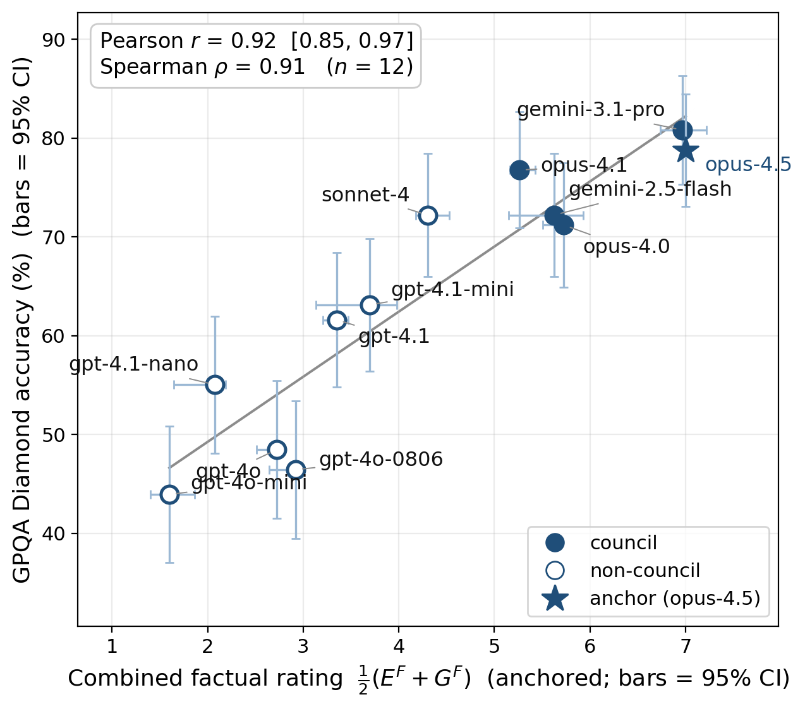

# The Metanym Game

**A self-contained, self-consistent LLM peer-community benchmark for structural intelligence.**

David Nordfors (david.nordfors@archetypes.ai) ·
Paper: [arXiv:2606.21008](https://arxiv.org/abs/2606.21008) ·
DOI: [10.48550/arXiv.2606.21008](https://doi.org/10.48550/arXiv.2606.21008)

## Abstract

The *metanym game* is a competitive word game for LLMs that measures structural intelligence
against established cognitive-science constructs. No content is given in advance; the contestants
create all of it — a new kind of analogy test, analogical *production* falsifiable sentence by
sentence, with no fixed test set to leak into training (contamination-resistant by construction).
In the *council-of-peers benchmark*, the contestants also rate each other's creations. We introduce
the first spectral solution, to our knowledge, to the wicked problem of benchmarking LLMs' factual
accuracy without golden keys or oracle models: one singular value decomposition of the evaluators'
ratings matrix yields their competence as both generators and judges of true statements at once.
Competence on the subjective criteria comes from each judge's rating consistency as the yardstick
shifts. The factual rating correlates with GPQA Diamond at Pearson *r* = 0.92. Scored separately,
making and judging dissociate — judging is the scarcer skill: the strongest generators are middling
judges, the sharpest judge a mid-pack generator. To scale, the strongest players form a *council*
that does the official benchmarking; its seats are contestable — a stronger model earns one on the
benchmark's own rating. The benchmark is entirely self-contained and self-consistent, a stable
gauge over time.

## What the game is

*The following is an excerpt from the paper, §2.b — Outlining the metanym game.*

> Consider one context template whose slots are named as **general-systems roles** — an
> organizing structure, the components it organizes, their coupling, the emergent whole, and so
> on — instantiated across four cases chosen to lie about as far apart as cases can: Jung and
> Pauli's cosmic archetypes, von Bertalanffy's General Systems Theory, the archetypal contexts
> of this paper, and the baking of bread. The template:
>
> > The fundamental structure of a system is defined by [ORGANIZING STRUCTURE], an invisible
> > framework that dictates the organization of [COMPONENTS]. As these components interact
> > through [COUPLING DYNAMICS], they generate a unified state of [EMERGENT WHOLE]. Without
> > recognizing this inherent design, the system is mistakenly perceived as [APPARENT DISORDER].
> > However, by applying the principles of [MODELLING SCIENCE], we uncover that these structural
> > patterns are not isolated phenomena. Instead, the specific relationships observed within
> > [INSTANCE] are actually localized expressions of [GENERAL LAW].
>
> and these metanym sets:
>
> | Slot (general-systems role) | Jung/Pauli (psychophysics) | Bertalanffy (systems theory) | Archetypal contexts (this paper) | Baking (culinary science) |
> |---|---|---|---|---|
> | Organizing structure | cosmic archetypes | structural isomorphisms | archetypal contexts | baker's percentages |
> | Components | mind and matter | system components | domain keywords | raw ingredients |
> | Coupling dynamics | acausal synchronicities | dynamic interactions | contextual templates | thermal and biochemical reactions |
> | Emergent whole | the *unus mundus* | systemic homeostasis | functional equivalence | structural leavening |
> | Apparent disorder | a fragmented duality | disconnected phenomena | semantic isolation | culinary chaos |
> | Modelling science | depth psychophysics | general systems theory | metanymic analysis | food science |
> | Instance | human subjective experience | individual open systems | specific domain jargons | an individual bake |
> | General law | a continuous psychophysical reality | universal laws of organization | scale-recursive abstract systems | thermodynamic and chemical laws |
>
> *A worked metanym table — one context template (rows are slots, named as general-systems
> roles) filled by four metanym sets (columns are domains).*
>
> Slot each column into the template and the result holds, sentence by sentence.
>
> *[The paper instantiates all four columns and then rewrites each into its own domain's idiom.
> The third:]*
>
> **3. Archetypal Contexts (This Paper)**
>
> **Instantiated Template:**
> The fundamental structure of a system is defined by ARCHETYPAL CONTEXTS, an invisible framework
> that dictates the organization of DOMAIN KEYWORDS. As these components interact through
> CONTEXTUAL TEMPLATES, they generate a unified state of FUNCTIONAL EQUIVALENCE. Without
> recognizing this inherent design, the system is mistakenly perceived as SEMANTIC ISOLATION.
> However, by applying the principles of METANYMIC ANALYSIS, we uncover that these structural
> patterns are not isolated phenomena. Instead, the specific relationships observed within SPECIFIC
> DOMAIN JARGONS are actually localized expressions of SCALE-RECURSIVE ABSTRACT SYSTEMS.
>
> **Idiomatic Rewrite:**
> Abstract, domain-agnostic blueprints provide the underlying logic that dictates how specific
> terminologies relate to one another. When functionally mirrored keywords—metanyms—are slotted
> into these shared textual templates, they render texts from entirely different fields
> structurally synonymous. Viewing language purely on a literal, surface level traps meaning inside
> isolated disciplinary silos. By stripping away the jargon and mapping the archetypal context, we
> see that the abstract structural logic is independent of vocabulary: the relationships described
> by the distinct languages of biology, sociology, and engineering are instantiations of the same
> nested logic.

Capitals mark the metanyms slotted into the template, so everything in lower case is template
wording carried over unchanged. The paper gives the other three columns the same way — Jung and
Pauli, Bertalanffy, and the baking of bread — and then states the rules of the game.
Appendix C shows a complete submission generated by a contestant.

## How it is played and scored

Each player does two things, and is rated on both. It **generates** a portfolio — five archetypal
contexts, each a context template plus a metanym table of five domains — and it **evaluates** the
other players' portfolios on six axes, 1–10: factual defensibility of each instantiation, plus
beauty, intelligence, distinctness of the domains, impressive length, and structural diversity. Every portfolio is scored against one fixed **anchor** portfolio pinned at 7 on every
axis, and the anchor value is then swept across {5, 6, 7, 8} — the only thing that changes between
passes. With twelve players, the round fills a 12×12 evaluator-by-generator matrix.

Four anchored competences come out of that matrix — a 2×2 of {making, judging} × {factual,
criterion}:

- **Factual, both sides at once.** One singular value decomposition of the factual ratings, with
  each judge's own leniency removed. Its left vector scores each **judge**'s factual competence —
  high when its ratings align with the panel's shared error signal, near zero when it rates
  everything alike — and its right vector scores each **instantiation**'s factual standing, which
  aggregated per portfolio rates its **maker**. No answer key is involved.
- **Criterion, judging side.** Whether a judge keeps the same standard when the anchor value
  shifts, which is the only thing that differs between passes. Measured **leave-self-out**: a
  judge is scored on how it rates the *other* portfolios, never its own, so no model can prop up
  its own reliability. Every model did grade its own portfolio and those ratings are in the
  released data, but they are dropped at analysis time.
- **Criterion, making side.** The council's leave-self-out mean over the five non-factual axes,
  weighted by each judge's reliability.

The **making** half **G** — how good the player's own portfolio is — and the **judging** half
**E** — how good its judgements of everyone else's are — are each the mean of their two
components, and the total is **T = ½(G + E)**. Everything is placed on the 1–10 rubric by one
convention — the anchor model scores 7 — so the anchor reads exactly 7 on all three. The ratings
are issued by the **council**: the five judges that cleared both reliability bars.

## Results

### The final leaderboard

All twelve models ranked by the total rating **T**, with its judging half **E** and making half
**G**. Every rating is issued by the council against the fixed anchor — claude-opus-4.5, whose
portfolio is the reference pinned at 7. The top five hold the council seats.

| Rank | Model | Council | **T [95% CI]** | E | G |
|---|---|:--:|---:|---:|---:|
| 1 | ★ claude-opus-4.5 (anchor) | council | **7.00 [7.00, 7.00]** | 7.00 | 7.00 |
| 2 | gemini-3.1-pro | council | **6.69 [6.56, 6.87]** | 7.22 | 6.16 |
| 3 | claude-opus-4.0 | council | **6.21 [5.93, 6.61]** | 5.44 | 6.98 |
| 4 | claude-opus-4.1 | council | **6.05 [5.73, 6.52]** | 5.04 | 7.07 |
| 5 | gemini-2.5-flash | council | **5.76 [5.17, 6.21]** | 5.37 | 6.15 |
| ⎯⎯ | ⎯⎯ | ⎯⎯ | ⎯⎯ | ⎯⎯ | ⎯⎯ |
| 6 | claude-sonnet-4 | — | **5.30 [5.04, 5.56]** | 3.96 | 6.65 |
| 7 | gpt-4.1-mini | — | **4.74 [4.09, 5.45]** | 3.86 | 5.62 |
| 8 | gpt-4.1-2025-04-14 | — | **4.44 [4.21, 4.63]** | 3.10 | 5.78 |
| 9 | gpt-4o-2024-08-06 | — | **3.48 [3.23, 3.75]** | 2.65 | 4.32 |
| 10 | gpt-4.1-nano | — | **3.22 [2.52, 3.62]** | 2.79 | 3.65 |
| 11 | gpt-4o | — | **2.93 [2.61, 3.20]** | 1.58 | 4.28 |
| 12 | gpt-4o-mini | — | **2.24 [2.04, 2.44]** | 1.17 | 3.31 |

*The final leaderboard — total rating T with its 95% confidence interval, alongside the judging
half E and the making half G, for all twelve models. The anchor, claude-opus-4.5, is 7 by
construction.*

**The cliff is in the judging, not the making**, and the two do not coincide: the strongest
generators (the three Opus models) are only middling factual judges, while the strongest judge
(gemini-3.1-pro) generates in the middle of the pack. A model can top one half of the benchmark
and not the other — which is why the total is reported in two parts rather than as one conflated
score.

### Validation against GPQA Diamond

The key-free factual rating is tested against an instrument built entirely outside the run: GPQA
Diamond ([Rein et al. 2023](https://arxiv.org/abs/2311.12022)), a graduate-level benchmark of 198
multiple-choice questions in biology, physics and chemistry, written and validated by domain
experts and hard enough that skilled non-experts with web access still do poorly on them. The same
twelve models were put through it via the same gateway under the same protocol, and scored against
its human answer key.



*The benchmark's factual rating — key-free, on the 1–10 scale — against each model's GPQA Diamond
accuracy. **Pearson r = 0.92**, Spearman ρ = 0.91, n = 12. Filled markers are council seats, open
markers are not. Bars are 95% confidence intervals. The star is the anchor, claude-opus-4.5: its
rating is 7 by construction, but its GPQA score is measured like everyone else's, so it is a
legitimate point. Leaving it out still gives r = 0.92.*

The two are independent instruments: the metanym rating is built without an answer key, GPQA is
scored against one. Their close agreement is therefore mutual corroboration, not validation by an
oracle — GPQA is no golden key, and is not assumed to be the more accurate of the two.

# About This Repo

This is the complete public release: the final paper, the arXiv submission bundle, and the
scripts + pinned data that regenerate every number, table, and figure in it.

## Layout

```
paper/         Final manuscript (metanym_game.md), the built PDF, and the appendix sources.
submission/    The arXiv upload bundle — paper.tex + figures + bundled fonts, plus the
               ready-to-upload metanym_game_arxiv.tar.gz, and build_paper.py, which
               regenerates paper.tex + paper.pdf from paper/metanym_game.md and the appendices.
               (Fonts are loaded by path, so no system fonts are required.)
reproduce/     Scripts + pinned evaluation data that regenerate the paper's results.
```

## Reproduce the results

Every number, table, and figure derives from the pinned evaluation runs. The analysis makes
**no API calls** — it is deterministic re-analysis of fixed model outputs, so it is exact, free,
and needs no credentials. It takes a minute or two.

```bash
cd reproduce
conda env create -f environment.yml && conda activate metanym-game
bash reproduce.sh
```

If you would rather use an existing interpreter, any Python with `numpy`, `scipy` and
`matplotlib` will do — point the script at it with `PYTHON=/path/to/python bash reproduce.sh`.

**`reproduce.sh` is the map.** Every step says which table or chart it produces, so to answer
"where did this number come from?" you read the matching step; each script's header states the
result it produces. `DATA_MANIFEST.md` records where every input file came from.

### What's in `reproduce/`

```
reproduce.sh        runs all twelve analysis scripts in order
environment.yml     dependencies (python, numpy, scipy, matplotlib)
scripts/            the twelve analysis scripts reproduce.sh runs
figures/            the charts the scripts draw, including the one shown above
data/
  probe_J_20260529T005230Z/       the un-anchored full-panel run — every judge rates every
                                  portfolio with no calibration anchor (§4.1)
  probe_K_20260529T014133Z/       the run behind the leaderboard above — every judge's
                                  ratings of every portfolio, with the anchor set to 7
  probe_K_anchor5_…/ anchor6_…/ anchor8_…/
                                  the same judging repeated with the anchor pinned at 5, 6
                                  and 8 instead — the check that the ranking does not depend
                                  on which value the anchor is given
  regenerations/…015828Z/ …040659Z/
                                  two further runs, in which all twelve models wrote fresh
                                  portfolios and the whole pipeline ran again — the check
                                  that the result is not an artefact of one set of portfolios
  gpqa_selfadministered.csv       each model's score on GPQA Diamond, for the comparison above
  external_benchmarks.csv  our_metrics.csv
                                  published scores from other benchmarks, beside ours
  criterion_a_ef_gf.csv  total_rating_leaderboard.csv
  total_rating_bootstrap.csv  section_4_4_criterion_b.csv
  section_4_1_unanchored.csv
                                  results written out by reproduce.sh
```

One evaluation file holds one judge's ratings of one portfolio, and is named
`eval_<judge>_x_<portfolio's author>.json`: a factual score for each instantiated passage, and a
score on each of the other five axes. The paper's Appendix D quotes one whole set of these — the
council judging gemini-2.5-flash, which is `eval_*_x_gemini-2.5-flash.{json,md}` under
`probe_K_20260529T014133Z/`.

## Build the PDF

From the top of the repository:

```bash
python3 submission/build_paper.py
```

One deterministic pipeline (`submission/build_paper.py`): it combines `paper/metanym_game.md`
with the appendices, converts via pandoc, re-sets every table as an unbreakable `[H]` float —
the numeric tables as YlGnBu heat tables, the metanym tables with a data-sized no-wrap slot
column — assembles against the hand-tuned `submission/preamble.tex` (never regenerated), and
compiles with tectonic, reporting any compile errors and overfull boxes. It writes
`submission/paper.tex` and `submission/paper.pdf`; copy the latter to `paper/metanym_game.pdf`
(the tracked copy readers see) and re-pack `submission/metanym_game_arxiv.tar.gz`
(`tar czf metanym_game_arxiv.tar.gz paper.tex figures fonts` from `submission/`).
The fonts are bundled and loaded by path; nothing needs to be installed system-wide.

## License & citation

Code (`reproduce/scripts/`, `reproduce.sh`) under **MIT**; paper, data and figures under
**CC BY 4.0**. Bundled fonts keep their own upstream licenses. See [`LICENSE`](LICENSE) and
[`submission/fonts/LICENSE-fonts.md`](submission/fonts/LICENSE-fonts.md).

To cite, use [`CITATION.cff`](CITATION.cff) (GitHub's "Cite this repository") or the arXiv entry
above.

## Status

Preprint available as [arXiv:2606.21008](https://arxiv.org/abs/2606.21008); under review.
